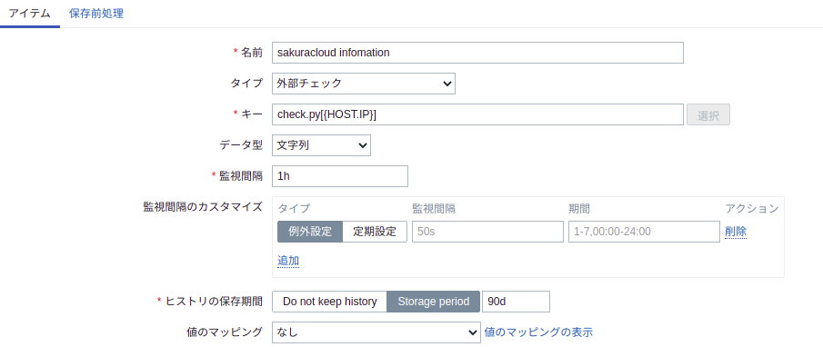
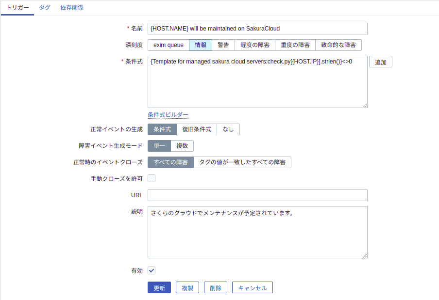

さくらのクラウドは不定期にわりと高頻度にメンテナンスが実施される  
指定された日までに再起動して、別ホストに移さなければ、不意の再起動を食らう。
メールで連絡は来るが、見落とすことが多かったので、zabbixでメンテナンスの有無を監視した。

# 作ったもの

sakuracloud-maintenance-checker  
https://github.com/sakakinox/sakuracloud-maintenance-checker

## 機能
- 引数にIPを利用する。
- さくらのクラウドのAPIを利用して、インスタンスのメンテナンス情報を参照する。

zabbixサーバーから利用することを想定しているのでIPからインスタンスを特定できるようにした。

```shell
./check.py InstanceIP
```

 * メンテナンス情報がある場合は対象URLが出る。
 * メンテナンス情報がない場合は何も出ない。
 * エラーの場合は内容に応じたメッセージが出る。
    * "API key not exist." API情報が空のときに表示される。
    * "API server error Code" APIserverから200以外のステータスが返ったときに表示される。
    * "引数が足りません。" 引数をつけずに実行したときに表示される。


# zabbix設定
下記のディレクトリにcheck.pyをデプロイすると外部チェックで利用できるようになる。
```
/usr/lib/zabbix/externalscripts
```
## アイテム設定


|名前|タイプ|キー|データ型|監視間隔|
|--|--|--|--|---|
|任意|外部チェック|check.py[{HOST.IP}]|文字列|1h|

実行するたびAPIを叩くので監視間隔を短くしすぎると嫌がられるかも

## トリガー設定


トリガはなにか出力されたら検出する設定とした。
```
check.py[{HOST.IP}].strlen()}<>0
```
# まとめ
Zabbixにアラートが表示されるので見落とさない。  
メンテナンス内容まではわからないのでURLを閲覧する必要がある。  
エラーが出力された場合もアラートが上がるので注意。  

# 参考サイト
https://developer.sakura.ad.jp/cloud/api/1.1/

おしまい