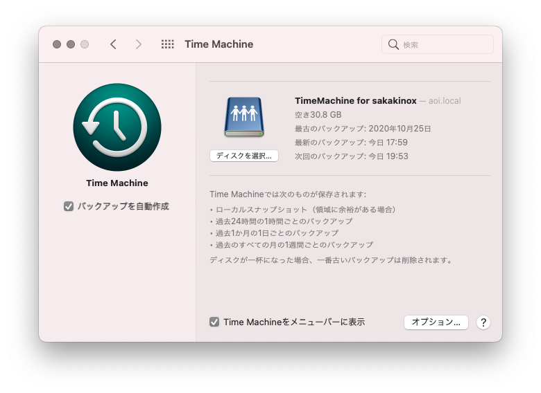

Ubuntu18.04から20.04にアップデートしたところMacBookのバックアップが取れていない事に気づいた。  
原因を調べて解決したので作業メモ。

# バージョンアップが原因

Ubuntu18まではaptでインストールされるNetatalkのバージョンはNetatalk 2.xだったのに対して  
Ubuntu20にアップデートしたタイミングでNetatalkのバージョンがNetatalk 3.1.12に上がっていた。

## Netatalk2.xとNetatalk3.xはconfの互換性がない

調べるとNetatalk2.xとNetatalk3.xはconfの互換性がないことがわかった。

Netatalk2.xは下記のファイルを使うのに対して

- afpd.conf
- AppleVolumes.default

Netatalk3.xは上記のファイルは読み込まず下記の1つだけで設定するようだ。

- afp.conf

書式も変更されている。

```shell
; [My Time Machine Volume]
; path = /path/to/backup
; time machine = yes
```

正直新書式のほうがわかりやすい。

## confを作り直す

幸い元のconfが残っていたので設定を移していく。

```shell
/home/DATA/timemachine/sakakinox "TimeMachine for sakakinox" cnidscheme:dbd allow:sakakinox volsizelimit:512000 options:usedots,upriv,tm
/home/DATA/timemachine/dev "TimeMachine for dev" cnidscheme:dbd allow:dev volsizelimit:512000 options:usedots,upriv,tm
/home/DATA/iTunes "iTunes"
```

Mac2台のtimemachine設定とiTunesディレクトリがある。  
現在iTunesは使っていないので設定不要  
volumesizeも現在はそれぞれパーティションを切っているので設定不要

```shell
[TimeMachine for sakakinox]
path = /home/DATA/timemachine/sakakinox
valid users = sakakinox
time machine = yes

[TimeMachine for dev]
path = /home/DATA/timemachine/dev
valid users = dev
time machine = yes
```

netatalkを再起動する。

```shell
systemctl restart netatalk
```

# Macから確認



無事認識されてバックアップが取れた。


UbuntuはLTSのアップグレードを保証してくれているのは助かるけど  
たまにサービスがメジャーアップデートされて動かなくなる事があるので注意が必要。

おしまい