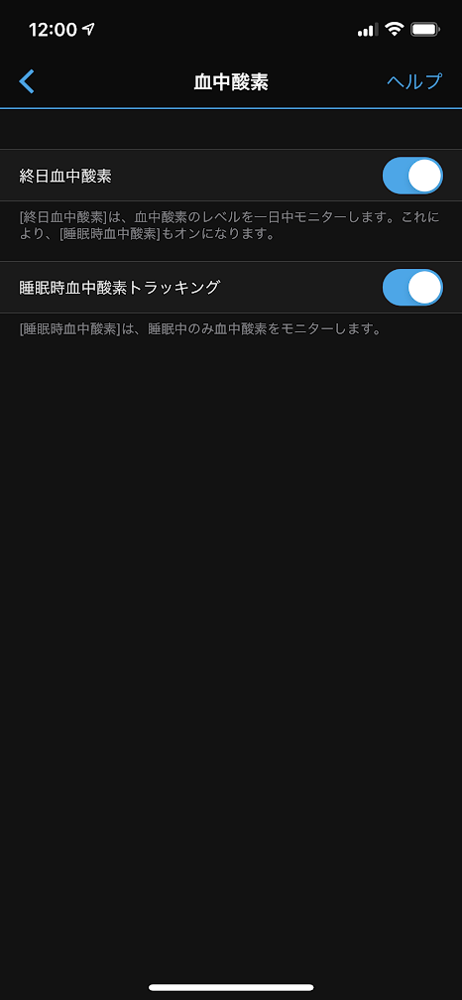
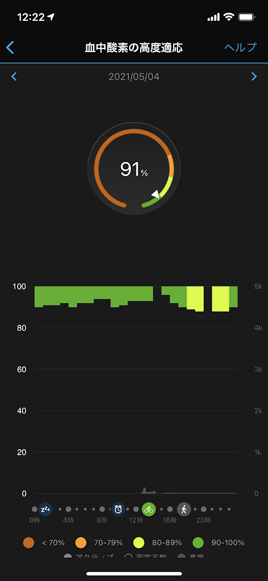

SpO2センサーは血中酸素濃度を測定するセンサーで、Garminのいくつかのウェアラブルデバイスに搭載されていたセンサーです。
日本向けの製品にもセンサー自体は搭載されていました。
しかし、日本の薬事法では血中酸素濃度を測るパルスオキシメーターは
管理医療機器となり製造販売は認可制となります。
Garminは発売以来認可されないか、申請そのものをしておらず
利用できない状態が続いていました。

# 対応機種(2021-04-06時点）

- ForeAthlete 945/745/245シリーズ
- VENU/VENU SQシリーズ
- vivoactive 4/4Sシリーズ
- Legacyシリーズ
- vivomove 3/3Sシリーズ
- vivomove Style/Luxeシリーズ
- vivosmart 4
- Approach S62
- MARQ
- fenix 6シリーズ
- Quatix 6X
- Enduroシリーズ
- fenix 5X Plus
- Instinct Dual Powerシリーズ
- Descent Mk2/Mk2i
- Lilyシリーズ

**センサーを有効にするにはウェアラブルデバイスのソフトウェア更新が必要です**。

# 血中酸素濃度測定を有効にする

設定->Garminデバイス->対応デバイス->ライフログ->血中酸素

終日血中酸素と睡眠時血中酸素トラッキングをオンに設定

血中酸素濃度測定をオンにするとバッテリー消費が激しくなる場合があります。

# 血中酸素濃度を測定する時は時計の付け方に注意

測定精度を高めるためにデバイスは手の甲の尺骨の突起にかからない位置に装着し、デバイスがずれないようにかつきつすぎない程度にバンドを調整します
起床時に測定するときにはデバイスを心臓の高さで測定する。
就寝時はデバイスをした腕が体の下敷きになるなど血流に影響を与える姿勢をなるべく避けてください。

難しいな...

正直いつ測ってるかもよくわからないのでできることはバンド調整ぐらいでした
定期的に測定していて、かつ自分が好きなときに測定ができるので
自分で測定する時は上記のことを意識すると良いと思います。

# 精度は如何に

一日つけてみたのですが、95%〜100%が理想的と言われているそうですが
なかなかそのレンジに乗りません。腕についていて心臓の高さにあることは稀だし少し低めに表示されているかもしれません。
数字に一喜一憂せず傾向で捉えたほうがいいかもしれません。

# SpO2センサーが有効になって素直に嬉しい

昨年発売した`apple watch Series 6`でSpO2センサーが日本でも認可されて
嫉妬していたGarminユーザーとしては素直に嬉しいです。
肺炎等になると血中酸素濃度が下がると言われていて血中酸素濃度を定期的に測定することで病気の兆候がわかるかもしれないそうです。
医療機器ほどの精度で測ることはできないかもしれませんが、健康管理に一役買ってくれるとうれしいです。

最後に、Garminがあらゆる関連ページで口を酸っぱくして言っていますが

Garminデバイスは医療機器ではありません。Garminデバイスは、いかなる病状の診断または観察のための使用を意図しておりません。

くれぐれもこのSpO2の値を根拠に病院に駆け込んだりすることは避けましょう。

# 参考サイト

https://www.garmin.co.jp/news/pressroom/news2021-0406-blood-oxygen-tracking/