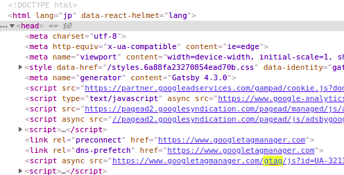

このブログはあまり人が来ないけど、google analyticsのタグを埋めてある。
正直今の状態で満足しているが、6ヶ月ぐらい前から毎月のようにgoogleがタグをアップグレードせよと言ってくるので対応した。

## gtag.jsはどんなメリットがあるのか

メールにはこう書いてあった

- プライバシーを重視した測定

  ​	よりプライバシーに気を使って情報収集する

- コード不要のタグ管理

  ​	機能追加や測定のon/offをコンパネ上からできる

- スピーディーで手軽な連携

  ​	google広告とかその他のサービスとも連携できる


google広告とか使っていると少しメリットがあるのだろうか。
現時点であまり私にとってのメリットはないように思う。


## gatsby.jsにどうやって実装するか

SPAのサイトはDOMだけ更新するのでうまくページ遷移が取りにくい
このサイトももともとgatsbyのプラグイン(`gatsby-plugin-google-analytics`)で実装してもらっている。
今回は基本的にプラグインの置き換えて対応完了となる。

## gatsby-plugin-google.gtagのインストールと設定

何はなくともプラグインのインストール

```shell
npm install gatsby-plugin-google-gtag
```

gatsby-config.jsを編集する。
gatsby-plugin-google-analyticsをコメントアウト
gatsby-plugin-google-gtagを下に追記。
必要そうなトラッキングIDとヘッダーに追加する設定だけ入れた。
トラッキングIDはanalytics.jsの頃から変更無いので、以前同様envから入力する。

```js
plugins: [
//{
//  resolve: `gatsby-plugin-google-analytics`,
//  options: {
//    trackingId: `${process.env.GOOGLE_ANALYTICS_ID}`,
//    head: true,
//  },
//},
	{
      resolve: "gatsby-plugin-google-gtag",
      options: {
        trackingIds: [`${process.env.GOOGLE_ANALYTICS_ID}`],
        pluginConfig: {
          head: true,
        },
      },
    },
 ]
```


## 動作確認と後処理



無事gtagが読み込まれたのでコメントアウトした`gatsby-plugin-google-analytics`のプラグインの設定を削除してプラグインも削除した。

```shell
npm uninstall gatsby-plugin-google-analytics
```

これで対応完了。
gatsbyv2.xでインストール時に実は一度環境を壊してしまったので気軽にlatestをインストールせず
依存関係をチェックしてから行いましょう。
このプラグインがきっかけてgatsbyのバージョンをv2からv4に上げたのですがその話はまたいつか

## 参考

https://www.gatsbyjs.com/plugins/gatsby-plugin-google-gtag/

https://developers.google.com/analytics/devguides/collection/gtagjs/migration?hl=ja


おしまい