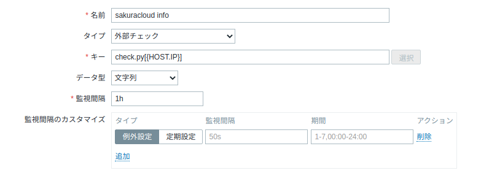
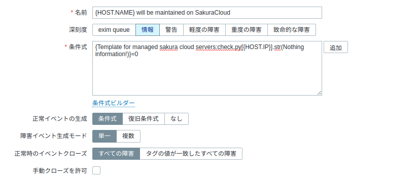

## 経緯

下記の記事で紹介したようにさくらのクラウドのメンテナンス情報をzabbixで監視するスクリプトを書いた。

https://sakakinox.net/posts/p11/ 

これを社内で使ってくれたが、うまく動かないということで改修してプルリクエストをくれた。
とてもありがたい。

## 機能追加

今までは共有セグメントのIPアドレスしか取得できなかったが
この改修でその他のIPや2番目、3番目のNICのIPアドレスにも対応した。  
複数のNICに対応したことでローカルIPも検索可能となったが、
ローカルIPをサポートする場合別のスイッチに所属しているNICのIPを考慮する必要があった。  
現状ではIPが複数サーバーで確認された場合エラーとなるように設定した。  
また、成功したか、失敗したかイマイチわかりにくいということで、**成功時にもメッセージを返すように**
**仕様変更した**。  
zabbixの設定変更が必要となるが、確かにユーザフレンドリーな仕様ではないので仕様変更した。

## その他修正
利用していただいていることがわかったのでこれを機に例外処理を強化した。  
jsonを取得する際の例外処理を強化した。  
httpのリクエスト取得の失敗時や、ロードしたものがJSONではないときにもエラーが返るように修正した。
またサーバー停止時やIPアドレスがないとき、複数サーバーが見つかったときにそれぞれメッセージを返すように修正した。
最後に、エラーメッセージの言語を英語に統一した。
詳しくはこちら

https://github.com/sakakinox/sakuracloud-maintenance-checker


## 修正に伴うzabbixの設定変更

破壊的な変更として、**正常時も”Nothing information!”が返る**のでzabbixの設定変更が必要になった。
それに伴いzabbixのトリガー条件式を修正した。
下記の設定は私の環境で変更したもの。
トリガー設定は非常に重要なので変更後は念入りにテストしましょう。

アイテムは変更なし



トリガーの設定を変更


変更後のトリガー条件式

```
{Template for managed sakura cloud servers:check.py[{HOST.IP}].str(Nothing information!)}=0
```

スクリプト更新後
Nothing information!が帰ってくることを確認した。  
API情報を削ってエラーを出し、トリガーが動作することを確認した。

## 今後も機能追加したい

複数のアカウントを監視する場合にAPIkeyをzabbix側で切替えられるようにしたい。  
また、現状ではリージョン決め打ちでしか動作しないので、切替えられるようにするか全てのリージョンを対象に検索をかけたい。  
監視台数が増えるとAPI取得回数が増えるので迷惑がかからない方法を考えたい。

よかったら使ってください。  
おしまい

## 参考

https://www.zabbix.com/documentation/4.2/en/manual/appendix/triggers/functions