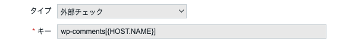

zabbix の監視のデモをすることになり簡単な監視ネタを探していた。
ただ apache を落として監視してもいいけどなにか体験できる形のデモのほうがいいかなと思い Wordpress に記事を投稿したりコメントを書いたらアラートが出るというデモをすることにした。

## 仕組み

wordpress の API を使って記事数とコメント数を取得する
一定時間ごとに記事数とコメント数を zabbix で監視
変更されたら通知

## API の準備

ググるとさも当然のように API をつかっている紹介記事がヒットするが、API の利用にはプラグインのインストールが必要だった。
今回インストールしたのは"WordPress REST API (Version 2)"
これをインストールして有効化した

その後パーマリンク設定を日付と投稿名に変更した。
なぜかデフォルトのままでは API が利用できなかった。
今回はデモが目的なのであまり深く調べなかった。

## Wordpress がインストールされているかチェックするコマンド

```shell
#!/usr/bin/env bash

curl -s https://$1 |grep wp-include|wc -l
```

curl して wp-include の数を数えただけ

## Wordpress の記事数をチェックするコマンド

```shell
#!/usr/bin/env bash

curl -s https://$1/wp-json/wp/v2/posts |jq '. |length' 2>/dev/null
```

URL を渡すと記事数が取得できる

## Wordpress のコメント数をチェックするコマンド

```shell
#!/usr/bin/env bash

curl -s https://$1/wp-json/wp/v2/comments |jq '. |length' 2>/dev/null
```

URL を渡すとコメント数が取得できる

## Zabbix の設定

作ったスクリプトを ` /usr/lib/zabbix/externalscripts/`に配置する。
アイテムを外部チェックにしてキーの設定をする。
今回はサーバー名を渡す形とするので`{HOST.NAME}`とした。



## まとめ

zabbix で Wordpress の記事数とコメント数を取得してみました。
実際の監視で利用するケースは少ないと思うけど、工夫次第で色んなものが監視できることはわかると思う。

## 参考

https://wordpress.org/plugins/rest-api/

https://developer.wordpress.org/rest-api/

おしまい
