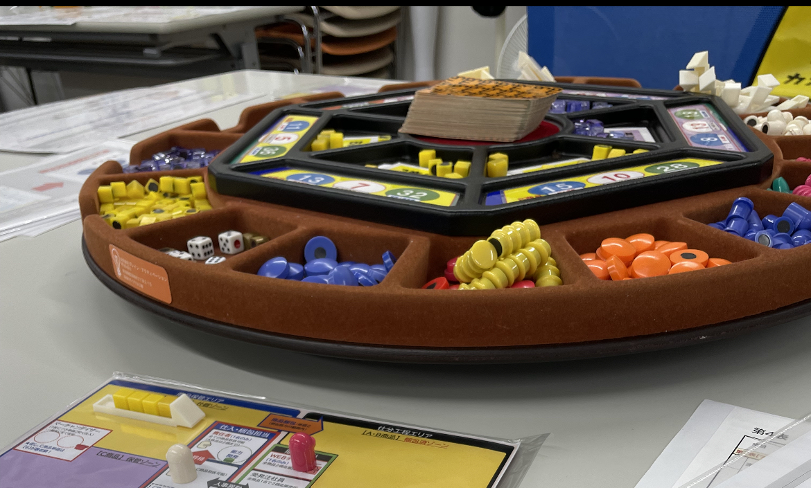

## MG研修とは

マネジメントゲームという会社経営ゲームで、資本金300万円を元手に企業して資本を増やすことを目指す。
題材が工業、商業などいろいろなバージョンがあるようだが、私の参加したのはeコマース版と呼ばれる
ネットショップを経営する形のゲームだった。

MG研修は巷で、25期で会計がわかる。50期で戦略がわかる。75期で経営がわかる。100期で人間がかわる。
と評されている。

## MG研修の流れ

4~5人1卓で商品を仕入れ、値付けして売る。
順番にカードを引き、意思決定を引いたときは行動でき、リスクカードを引くと、休みになったり、倉庫が燃えたりいろいろなリスクがある。
制限時間が終わるかだれかのシートがいっぱいになると期末処理が始まる。
売り買いの、記録を見ながら棚卸しをして売上を計算して経費を払って
その期の損益計算書を作り、貸借対照表をつくる（下書きで）
全員の計算があったら、講師の先生に総評を頂き、次のゲームへ進む

## MG研修で得られるもの

- PL、BSがどういうものか体でわかる。
- 現金の大切さが体でわかる。

特にPL、BSが少し読めるようになるのは私にとってよいことだった。
売り上げと利益違いを言葉では理解できていたものの、ゲームを通じて
売り上げから、この費用とこの費用が引かれて…というのが体感できることがとても良かった。
今回、黒字倒産してしまったのだが、期末、期首に出ていくお金がどのぐらいであるかなど、
気をつける点がたくさんあり、実生活に応用できそうなことがたくさんある。

100期続けて、ぜひ人間を変えたい。

## 　以下反省

１社目、６~９期の反省

おおよそ２年ぶりのMGでルールがおぼつかない中、６期からスタートした。
前回は社内の研修で参加したが、今回は外部の研修に参加したためか
市場の活力が全く違った、私は複数の商品の状態を把握して対応策を練れるほど要領が良くないので
B商品に注力した、B商品を大量に扱う会社があり、その隙間で細々と売るスタイルとなった。
その売り方がハマって８期を迎えたが、８期から掛売りが開始となった。
掛売りは主力のB商品を売っても期末にお金が入ってこないため、C商品を売って現金を作る必要が出てきた。
C商品はB商品と売り方が異なり、なかなかシェアが獲得できず、大幅な赤字となった。
９期目、短期借り入れなどを行い、期末までいったものの、手元の現金が少なく10期の期首の返済ができず倒産
自転車操業を始めようとして漕ぎ出せなかったかっこうとなった。

2社目、2~４期の反省

赤字になると借り入れができなくなるため、手元の現金を意識しながら、経営した。
手元の現金に余裕がある状態を維持できた。2巡目なので3期目から掛売りが始まったので
また、B商品に注力できた。
あまり大きいシェアを取ることができなかったが、その卓の状態としてはベストを尽くせたと思う。
お金にそこそこ余裕がある経営になれておらず、ターンを無駄にしていたきらいがあるので、研究開発などを
行なっておくと次回の布石になったのではないかと思う。
2日間参加したのだが、1日目の卓と2日目の卓は雰囲気が全く違うので、行動パターンを事前にいくつか考えておくことも大切と知った。

## 今回参加させていただいた研修

MG経営セミナーin【大阪5月】  
主催者　合同会社ブレインアクティベーション 左京 利章さん  
https://www.facebook.com/toshiaki.sakyoh

