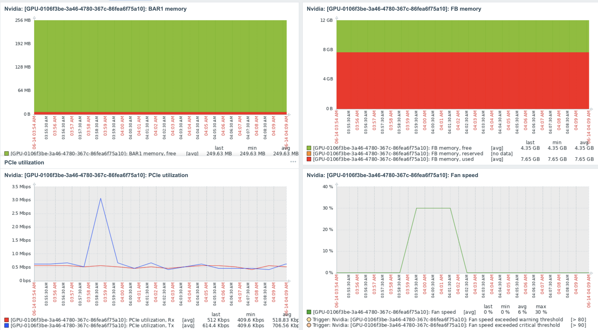

## はじめに

Machine Learningの流行でサーバーでもGPUを使う機会が増えてきたのではないだろうか。

そんな中ついにZabbix7.2から公式のGPU監視機能が追加された。

しかし、実際に試してみると、**nvmlライブラリ関連のトラブル**に直面した…...

この記事ではZabbix 7.0からのアップデート手順と、**GPU監視がうまく動かない原因とその解決策**を詳しく解説する。

## 環境

- Zabbixサーバー: 7.0.13　
  - LXCコンテナで実行
  - Ubuntu 24.04
- Zabbix Agent2
  - ホストサーバー
  - RTX3060
  - Ubuntu 24.04

## Zabbix 7.0から7.2へのサーバーアップグレード手順

Zabbixサーバーをアップデートする。

aptで入れているのでレポジトリを変更してupdateをかける。

zabbixサーバーにSSHでログインし、rootユーザーで実行する。

<OgpLink url="https://www.zabbix.com/jp/download?zabbix=7.2&os_distribution=ubuntu&os_version=24.04&components=server_frontend_agent&db=pgsql&ws=nginx" />

```shell
$ sudo -s
```


```shell
wget https://repo.zabbix.com/zabbix/7.2/release/ubuntu/pool/main/z/zabbix-release/zabbix-release_latest_7.2+ubuntu24.04_all.deb
dpkg -i zabbix-release_latest_7.2+ubuntu24.04_all.deb
apt update
```

この状態でパッケージを更新すればZabbixのバージョンが上がる。

このコンテナはzabbixしか使っていないので全てのパッケージをアップデートした。

特に本番環境で実行する際は依存関係などを確認して必要なパッケージだけアップデートすること。

```shell
apt upgrade
```

Zabbix7.2からFrontendのソースコードの位置が変更されており、うまく起動しなかったため修正した。

ZabbixのWEBUI上に修正手順が表示される。

```shell
sed -i s:/usr/share/zabbix:/usr/share/zabbix/ui:g
systemctl restart nginx
systemctl restart zabbix-server
```

データベースが自動的にアップデートされて通常利用できるようになる。

## Zabbix 7.2にGPU監視テンプレートを追加する方法

アップデートすれば監視できると思いきや、監視項目が増えなかった。

GPU用の監視テンプレートが入っていないようだったのでインストールした。

※もしかしたら7.0からアップデートしたことが原因かもしれない。

<OgpLink url="https://git.zabbix.com/projects/ZBX/repos/zabbix/browse/templates/app/nvidia_agent2/template_app_nvidia_agent2.yaml?at=release%2F7.2" />

このyamlをダウンロードしてZabbixのWebUIからインポートした。

TOP -> Data collection -> Templates -> Import

しかし監視データが取れなかった。

`Unknown metric nvml.device.get`

## Zabbix-Agentをアップデートする

監視先のZabbix-agentをアップデートした。

アップデート方法はzabbixサーバーとほぼ変わらず。

監視先であるホストサーバーで実行した。

```shell
wget https://repo.zabbix.com/zabbix/7.2/release/ubuntu/pool/main/z/zabbix-release/zabbix-release_latest_7.2+ubuntu24.04_all.deb
dpkg -i zabbix-release_latest_7.2+ubuntu24.04_all.deb
apt update
apt upgrade zabbix-agent
```

この状態でも監視データがとれず調べていると、Zabbix-agent2のプラグインをインストールする必要があることに気づいた。

aptで検索してみると`zabbix-agent2-plugin-nvidia-gpu`がヒットした。

```shell
apt search agent2
ソート中... 完了
全文検索... 完了
zabbix-agent2/不明,now 1:7.2.7-1+ubuntu24.04 amd64 [インストール済み]
  Zabbix network monitoring solution - agent

zabbix-agent2-dbgsym/不明 1:7.2.7-1+ubuntu24.04 amd64
  debug symbols for zabbix-agent2

zabbix-agent2-plugin-ember-plus/不明 1:7.2.7-1+ubuntu24.04 amd64
  Zabbix Agent2 plugin for monitoring Ember Plus installations

zabbix-agent2-plugin-mongodb/不明 1:7.2.7-1+ubuntu24.04 amd64
  Zabbix Agent2 plugin for monitoring MongoDB installations

zabbix-agent2-plugin-mssql/不明 1:7.2.7-1+ubuntu24.04 amd64
  Zabbix Agent2 plugin for monitoring MSSQL installations

zabbix-agent2-plugin-nvidia-gpu/不明,now 1:7.2.7-1+ubuntu24.04 amd64 [インストール済み]
  Zabbix Agent2 plugin for monitoring a broad range of NVIDIA GPU metrics

zabbix-agent2-plugin-postgresql/不明 1:7.2.7-1+ubuntu24.04 amd64
  Zabbix Agent2 plugin for monitoring PostgreSQL installations

apt install zabbix-agent2-plugin-nvidia-gpu
```

このプラグインインストール後にZabbix-Agentが起動しなくなった。

```
 6月 14 02:14:04 host zabbix_agent2[2922478]: zabbix_agent2 [2922478]: ERROR: Cannot register plugins: failed to register metrics of plugin "NVIDIA": failed plugin registration: Failed to validate plugin: Failed to validate nvml runner: faile>
 6月 14 02:14:04 host systemd[1]: zabbix-agent2.service: Main process exited, code=exited, status=1/FAILURE
```

## Zabbix Agent2がnvmlライブラリを読み込めない問題の解決

直接zabbix-agent2を実行するとnvmlのshared libraryが読み込めてないことがわかる。

```
# /usr/sbin/zabbix_agent2 -c /etc/zabbix/zabbix_agent2.conf -f
zabbix_agent2 [2925584]: ERROR: Cannot register plugins: failed to register metrics of plugin "NVIDIA": failed plugin registration: Failed to validate plugin: Failed to validate nvml runner: failed to create new nvml runner: NVML error: NVML Shared Library couldn't be found or loaded.

```

ライブラリはすでに存在した。

```
/usr/lib/i386-linux-gnu/libnvidia-ml.so.565.57.01
/usr/lib/i386-linux-gnu/libnvidia-ml.so.1
/usr/lib/x86_64-linux-gnu/yelp/libnvidia-ml.so.565.57.01
/usr/lib/x86_64-linux-gnu/yelp/libnvidia-ml.so.1
/usr/lib/x86_64-linux-gnu/libnvidia-ml.so.565.57.01
/usr/lib/x86_64-linux-gnu/libnvidia-ml.so.1
/usr/lib/libnvidia-ml.so.1
```

一応`lib`にシンボリックリンクを貼ってみたが起動せず。

Zabbixのフォーラムを彷徨うも、答えを見つけられず……

ソースコードを読んで、該当箇所を確認した。

該当箇所は716行目

<OgpLink url="https://git.zabbix.com/projects/AP/repos/nvidia-gpu/browse/pkg/nvml/nvml_linux.go?at=refs%2Fheads%2Frelease%2F7.2" />

```go
func loadLibrary() (unsafe.Pointer, error) {
	libName := C.CString("libnvidia-ml.so")
	defer C.free(unsafe.Pointer(libName)) //nolint:nlreturn

	handle := C.dlopen(libName, C.RTLD_LAZY|C.RTLD_GLOBAL)
	if handle == nil {
		return nil, ErrLibraryNotFound
	}
```

読み込みファイル名が`libnvidia-ml.so`になっていたのでシンボリックリンクを作った。

```shell
ln -s /usr/lib/x86_64-linux-gnu/libnvidia-ml.so.1 /usr/lib/libnvidia-ml.so
```

これで起動した。

```
systemctl status  zabbix-agent2
● zabbix-agent2.service - Zabbix Agent 2
     Loaded: loaded (/usr/lib/systemd/system/zabbix-agent2.service; enabled; preset: enabled)
     Active: active (running) since Sat 2025-06-14 03:49:52 JST; 9s ago
   Main PID: 2949841 (zabbix_agent2)
      Tasks: 22 (limit: 18710)
     Memory: 23.3M (peak: 25.0M)
        CPU: 188ms
     CGroup: /system.slice/zabbix-agent2.service
             ├─2949841 /usr/sbin/zabbix_agent2 -c /etc/zabbix/zabbix_agent2.conf
             └─2949868 /usr/libexec/zabbix/zabbix-agent2-plugin-nvidia-gpu /run/zabbix/agent.plugin.sock false
```

無事ローレベルディスカバリー（LLD）でGPUが検出されて監視できた。


ZabbixによってGPUがローレベルディスカバリーされ、温度や使用率が正しく取得できていることが確認できる。

## まとめ

予想以上にハマった。

当初zabbix-agent2のログに何も表示されず、systemdのログを頼りにいじっていた。

共有ライブラリが原因とわかってからは関係ありそうなプログラムをlddで調べていった。

最終ソースコードを読むことになるとは当初は思ってもみなかった。

ZabbixのGPUの監視は対応して日が浅く文献も少ないので誰かの助けになればよい。

## 参考

<OgpLink url="https://git.zabbix.com/projects/AP/repos/nvidia-gpu/browse/pkg/nvml/nvml_linux.go?at=refs%2Fheads%2Frelease%2F7.2" />

<OgpLink url="https://www.zabbix.com/jp/integrations/nvidia" />

おしまい
