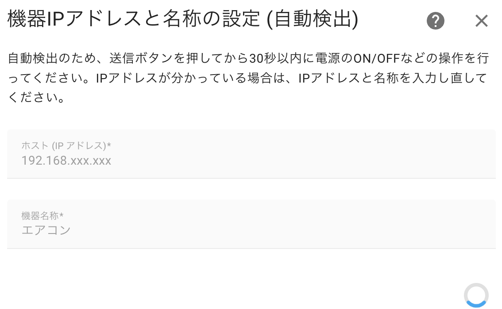
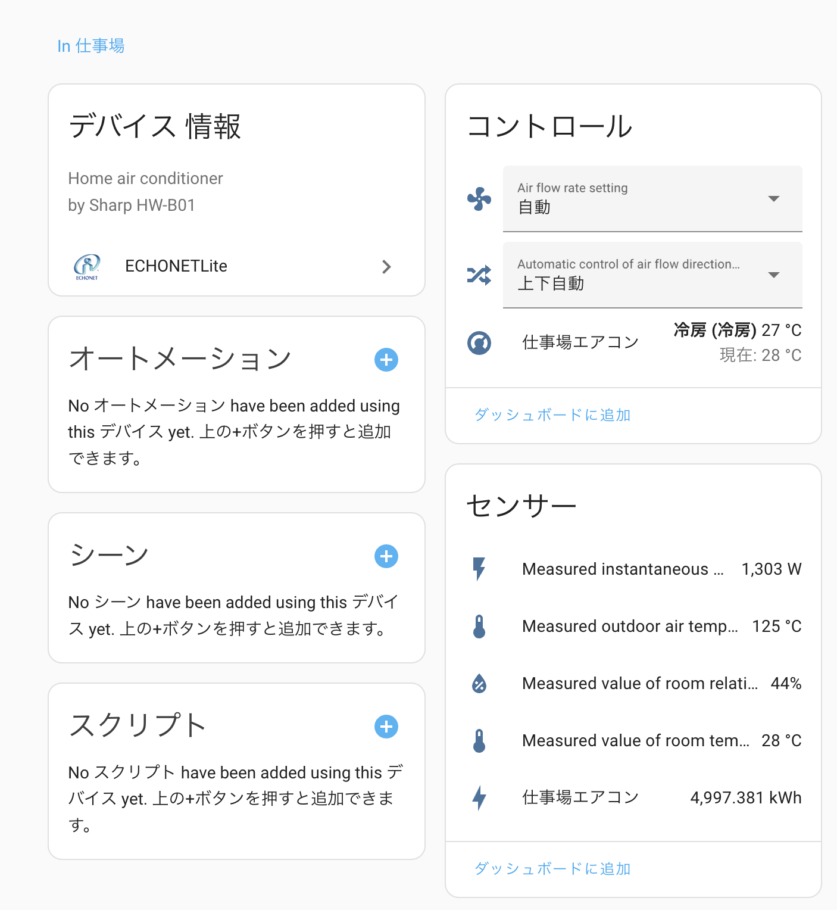
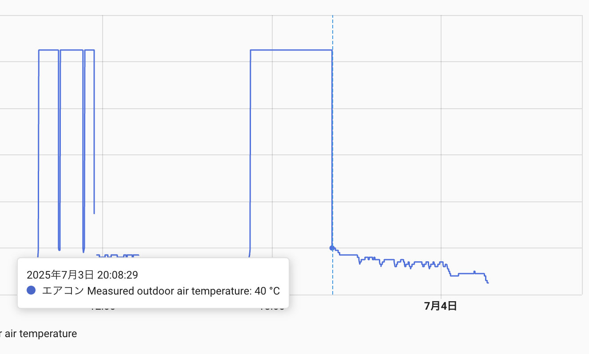
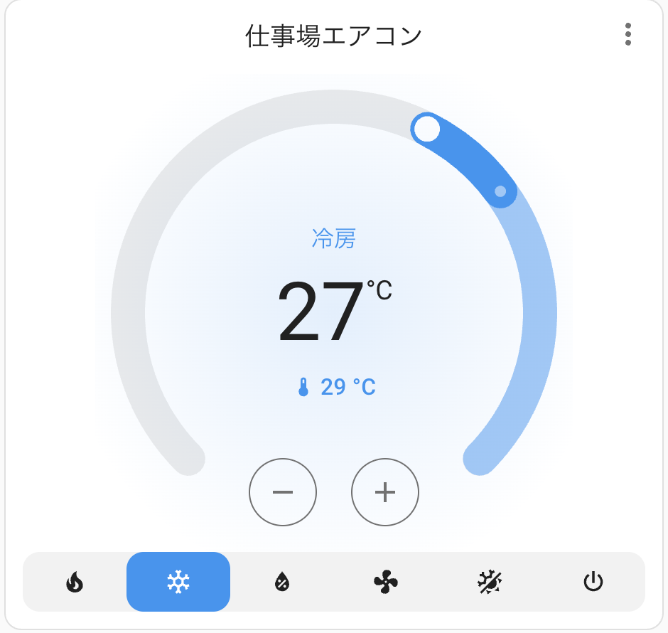

## はじめに

Wi-Fiに対応したエアコンをHome Assistantで操作したいと思い方法を模索していると、日本の大手メーカーのWi-Fi対応エアコンはECHONET Liteに対応していることが多く、統一された規格でデータの取得と操作ができることがわかった。

今回は自宅のエアコンをECHONET Lite経由でHome Assistantに登録しデータ受信とエアコン操作をしてみた。

## ECHONET Liteとはなにか

白物家電や住宅設備を中心に展開されているIoT規格の一つで、ベンダーを超えて通信できる規格であり、日本発のスマートホーム・HEMS向け標準規格である。

| 要素     | 内容                                                         |
| -------- | ------------------------------------------------------------ |
| 対象機器 | 白物家電（エアコン、冷蔵庫など）に加え、給湯器、太陽光発電、電力量計など住宅設備も含む |
| 通信方式 | 主にIP（Wi-Fi、Ethernet）や非IP（ECHONET Lite over Wi-SUNなど） |
| 規格名   | 正式名称は「ECHONET Lite（エコーネットライト）」             |
| 特徴     | オープン規格・マルチベンダー対応・相互接続試験が行われている |
| 運営団体 | 一般社団法人エコーネットコンソーシアム                       |

## 環境

- Home Assistant 2025.5.3
- プラグイン echonetlite_homeassistant with HACS
- SHARP AC-L56ATC

## Home Assistant にHACSをインストールする

まずHACS（Home Assistant Community Store）をインストールした。

HACSをインストールすることでサードパーティ製のプラグインを簡単にインストールできるようになる。

```shell
$ wget -O - https://get.hacs.xyz | bash -
$ sudo systemctl restart  home-assistant@homeassistant
```

再起動後にGitHubで認証手続きをした。

<OgpLink url="https://hacs.xyz/docs/use/configuration/basic/" />

## EHONET Liteのプラグインをインストールし設定する

HACSの検索窓でEHONETと検索するとヒットする`echonetlite_homeassistant`を利用した。
右下に表示されるダウンロードボタンをクリックしHome Assistantを再起動した。

設定->デバイスとサービス->ECHONETLite->エントリーの追加

ポップアップが表示されるのでIPアドレスと機器名（ここではエアコンを入力する）


エアコンが登録されると以下のようにセンサーの情報取得とコントロールができるようになった。



取得できたのは以下の8エンティティだった。

- Air flow rate setting（風量）
- Automatic control of air flow direction setting（風向）
- Measured instantaneous power consumption（瞬間消費電力）
- Measured outdoor air temperature（外部温度）
- Measured value of room relative humidity（室内湿度）
- Measured value of room temperature（室内温度）
- Measured cumulative power consumption（積算消費電力）
- 仕事場エアコン（エアコンコントロール）

外部温度センサーが125℃になっているがどうやら40℃以上は測れない仕様らしい。これはエアコンの機能に依存すると思われる。



図のように40℃を超えると値が125℃にジャンプしている。



上記はHome Assistantに表示されるコントローラだ。
直感的にわかりやすく、現在の温度と設定温度の差が見やすくていい感じだ。

## まとめ

Home AssistantにECHONET Liteのプラグインを導入しエアコンをコントロールできるようにした。

エアコン本体から起動状態を取得できるため、SwitchBotなどのIR経由の操作と比べ信頼性が高く、リモコンやスマホの操作を併用した状態でも起動状態を正しく反映できる点がとてもよい。

積算電力も取得できるのでエナジーダッシュボードで電力利用量の可視化もできそう。

ECHONET Liteは大手日本メーカーのエアコンはほとんど対応しているようなので、他のエアコンに関しても順次対応させていきたい。

## 参考

<OgpLink url="https://hacs.xyz/docs/use/configuration/basic/" />

<OgpLink url="https://github.com/scottyphillips/echonetlite_homeassistant" />

おしまい
