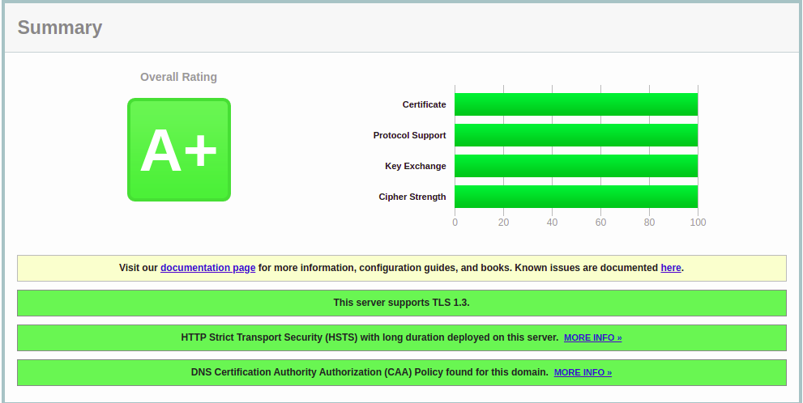
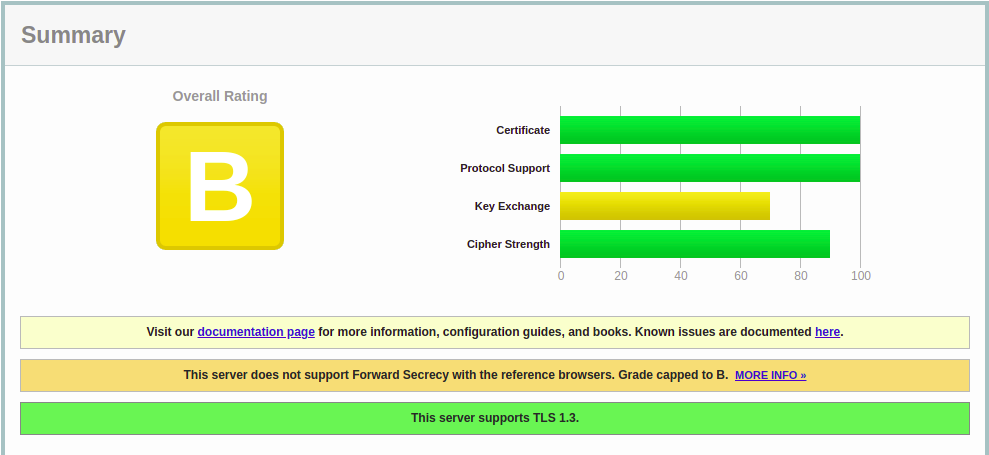

SSL Labs でA+を取り、全ての項目を満点にした  

## CentOS8 初期状態

初期状態はBでした  
デフォルトでTLS1.3+TLS1.2のみでした  
certificateとProtocolsupportは満点  
他は足りないところがあるので埋めていきます。

## Key Exchange

DHkeyを複雑にすればよいみたいです。  
確認すると、4096bitあれば満点になりそう  
デフォルトでは使用されていませんでした。

```shell
openssl dhparam 4096 -out dhparam.pem
```
作成になかなか時間がかかります。
```shell
        ssl_dhparam /etc/nginx/dhparam.pem;
```
## Cipher Strength
weekになってるciperを徐々に削っていきます。  
満点を取るには256bit以上の鍵である必要があります。  
`ssl_prefer_server_ciphers on;`することでサーバーが指定するcipher以外を使わせなくすることができます。

```shell
        ssl_ciphers HIGH:!CAMELLIA:!AES128:!SHA256:!SHA1:!SHA384:!ARIA128:!RSA;
        ssl_prefer_server_ciphers on;
        ssl_ecdh_curve secp384r1;
```
TLS1.3のcipherhはnginxの`ssl_chipers`で設定することができません。
Opensslのconfを編集して対応させます。  
**※OpenSSLを他のサービスで利用している場合には注意が必要です**  
/etc/pki/tls/openssl.cnf
```shell
[ crypto_policy ]

.include /etc/crypto-policies/back-ends/opensslcnf.config
```
`crypto_policy`は別ファイルに記述しているようです。  
/etc/crypto-policies/back-ends/opensslcnf.config
```shell
#Ciphersuites = TLS_AES_256_GCM_SHA384:TLS_CHACHA20_POLY1305_SHA256:TLS_AES_128_GCM_SHA256:TLS_AES_128_CCM_SHA256
Ciphersuites = TLS_AES_256_GCM_SHA384:TLS_CHACHA20_POLY1305_SHA256
```
上から下に書き換えます。

## HSTSを有効にする
ブラウザに次回以降httpsでアクセスするように伝えるヘッダを送信します。
これを設定するとAからA+になりました。
```shell
        add_header Strict-Transport-Security 'max-age=31536000; includeSubDomains; preload';
```

## おまけ

### OCSP stapling
```shell
        ssl_stapling on;
        ssl_stapling_verify on;
        ssl_trusted_certificate /etc/letsencrypt/live/sakakinox.net/chain.pem;
```
### DNS CAA
DNSにCAAレコードを追加した。
```shell
;; ANSWER SECTION:
sakakinox.net.		3600	IN	CAA	0 issue "letsencrypt.org"
```
### RSA-key-size
証明書自体も複雑にした
```shell
certbot renew --force-renewal --rsa-key-size 4096
```
## 参考サイト
https://github.com/ssllabs/research/wiki/SSL-Server-Rating-Guide  

おしまい